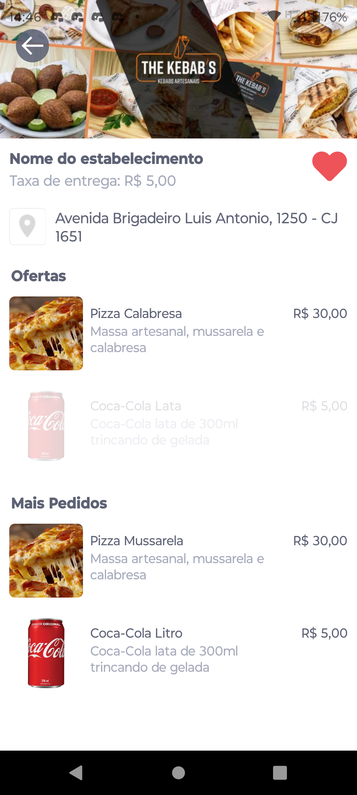

# Projeto FOODIE Delivery

### 🔥 Sobre
Projeto construído com as aulas do canal [DEV Point](https://www.youtube.com/@devpoint.oficial).
É um aplicativo de delivery que pode ser feito cadastro, login, pedidos....

Foi estilizado com stylesheet estilização nativa 

### 🔥 Tecnologias Ultilizadas

- **React Native:** 
- **Design | Layouts | UX:** Figma 
- **React Navigation:** 
- **Expo:**

|  |  | | 
|:----------------------------------------:|:----------------------------------------:|:----------------------------------------:|
|  |  ||

### Passos para instalação e inicialização

1. Instale as dependências do projeto:  
 ``npm install ``    

2. Inicie o projeto com o Expo:  
   ``npx expo start ``   